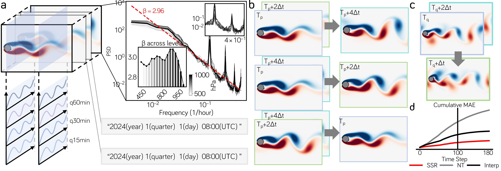
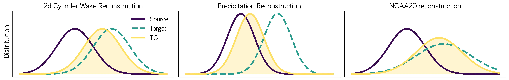
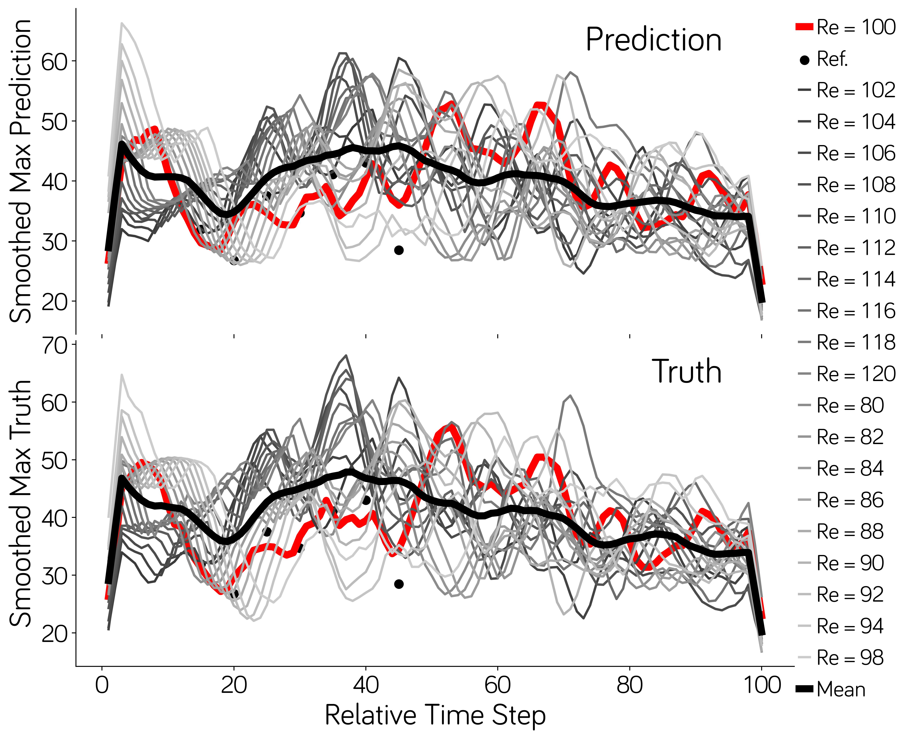
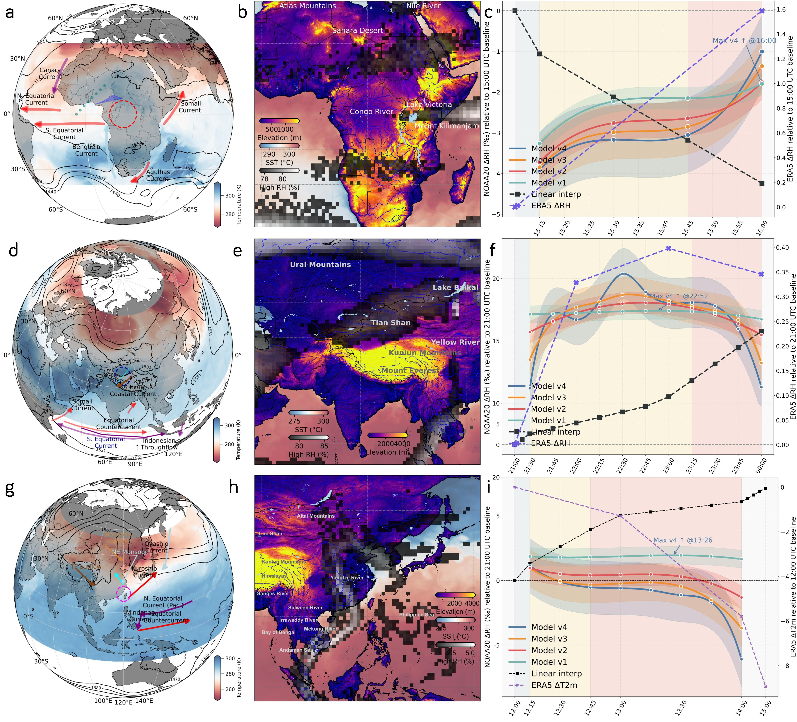

## 📚Token-Guided Self-Supervised Temporal Reconstruction

A diffusion‑transformer framework that turns **3‑hourly or hourly reanalyses into 15‑minute fields** without high‑frequency labels.  
The package contains:

* PyTorch + Diffusers code (`src/`)
* example experiment files (`configs/`)
* data stubs (`data/`)
* publication‑quality figures (`pics/`)

> **Highlights**
>
> - **Label‑free temporal super‑resolution**: a diffusion UNet is trained purely on coarse reanalysis sequences, learning to reconstruct sub‑hourly dynamics from hourly or 3‑hourly inputs without any high‑frequency ground truth.
> - **Token‑conditioned control**: discrete tokens that encode calendar date, seasonal phase and requested lead‑time enter each cross‑attention block, allowing the user to specify arbitrary target intervals (e.g., +15 min, +30 min) in a single forward pass.
> - **Historic reanalysis upgrade**: after ERA5‑Land pre‑training the model is fine‑tuned on NOAA‑20CR v3; it delivers a global 15‑min surface‑layer data set for 1806‑1910, opening new possibilities for extreme‑event attribution and early‑period data assimilation.

### 📁Repository Layout

```text
.
├── src/               # core implementation
│   ├── edm.py         # EDM noise schedule & sampler
│   ├── loss.py        # weighted‑conditional‑Gaussian (WCG) loss
│   ├── net.py         # UNet + token cross‑attention
│   └── train.py       # CLI for train / fine‑tune / infer
├── configs/           # *.yaml experiment recipes
├── data/              # tiny demo arrays + README
├── pics/              # figures used in the paper / README
├── requirements.txt   # pip install ‑r
└── README.md
```

## 📋Data

| Dataset                        | Native Δt | Target Δt | Notes                  | Download                                                     |
| ------------------------------ | --------- | --------- | ---------------------- | ------------------------------------------------------------ |
| ERA5‑Land rainfall (1961‑2024) | 1 h       | 15 min    | Global 0.1° grid       | [https://pan.quark.cn/s/69edae6a321d](https://pan.quark.cn/s/69edae6a321d) |
| NOAA‑20CR v3 RH (1806‑2015)    | 3 h       | 15 min    | 1° Gaussian grid       | [https://pan.quark.cn/s/69edae6a321d](https://pan.quark.cn/s/69edae6a321d) |
| 2‑D DNS cylinder wake          | 0.18 s    | 0.09 s    | Re = 80–120 test cases | [https://pan.quark.cn/s/69edae6a321d](https://pan.quark.cn/s/69edae6a321d) |

## ⏳Quick Start

### Install

```bash
  # clone & install
  git clone https://github.com/yourname/time-downscaling.git
  cd time-downscaling
  pip install -r requirements.txt
  conda create -n tdscale python=3.11 -y
  conda activate tdscale
  
  # download data
  bash scripts/fetch_data.sh   # edits PATHS automatically
```

### Train (example: ERA5 2 → 1 h)

```bash

# ------------------------------------------------------------------
# A. Two‑dimensional cylinder wake🌐 (Δt ↑ 2×, self‑supervised)
# ------------------------------------------------------------------
#  • Trains on Re = 100 wake snapshots    (0.18 s → 0.36 s)
#  • Evaluates phase‑sensitive recovery   (reconstruct missing 0.18 s)
python src/train.py --config configs/wake.yaml                # full training
python src/train.py --config configs/wake.yaml --infer        # quick inference on the pre‑packed test set

# ------------------------------------------------------------------
# B. ERA5‑Land rainfall🌦️   (1 h  → 15 min, cascade warm‑start)
# ------------------------------------------------------------------
#  • Stage‑1: 3 h → 1 h   (weights provided)
#  • Stage‑2: 1 h → 15 min (this command refines Stage‑2)
python src/train.py --config configs/era5_rainfall.yaml

# ------------------------------------------------------------------
# C. NOAA‑20CRv3 surface RH🌍   (3 h → 15 min, 1806‑2015)
# ------------------------------------------------------------------
#  • Fine‑tunes on the entire 20CR archive in self‑supervised mode
#  • Inference below regenerates sub‑hourly RH for a single year
python src/train.py --config configs/noaa20_rh.yaml --infer --year 1913
```

## 💡📈Model and Results Overview







## 🧪Citation

@article{Wang2025,
  title  = {Token-Guided Self-Supervised Temporal Reconstruction of Subhourly Climate Dataset since 1806},
  author = {Wang},
  journal= {Nature Machine Intelligence},
  year   = {2025},
}

## 🔓Licence & Contact

This project is released under the MIT licence.
Questions or pull‑requests are welcome:

🌐 GitHub Issues


📧 public_wlw@163.com

